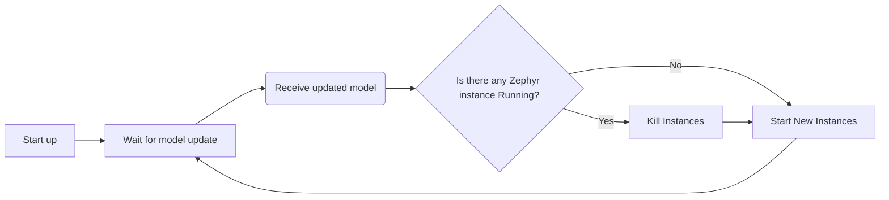

# FYP_Server_Zephyr
Server to update Zephyr files and restart QEMU Process

### Current Program Flow
1. Program kills any QEMU Instance currently running
2. Starts a new Zephyr Instance and let it run in the background
   1. Stores its PID
3. Start web server that listens for incoming updated tflite models
   1. On receipt, stores it in memory
   2. Overwrites model.cpp in zephyr instance 
4. Call method to restart zephyr instance with new model

### TODO:
1. Move away from absolute paths
2. Make necessary modifications for Linux file structure 

# Running this ENTIRE Project
## Required Repositories
1. FYP_Server_Zephyr (this current repository)
2. FYP_Tensor_Server (TODO: Add URL to this repo)
3. Zephyr tensor_server (TODO: Add URL to this repo)

# Program Flow



## Instructions
### Terminal 1
```
cd ~/Downloads/net-tools
./net-setup.sh -c zephyr1.conf -i zeth.1
```

### Terminal 2
```
cd ~/Downloads/net-tools
./net-setup.sh -c zephyr2.conf -i zeth.2
```

### Terminal 3
```
cd ~/Downloads/net-tools
./net-setup.sh -c zephyr3.conf -i zeth.3
```

### Terminal 4
```
cd ~/Downloads/net-tools
sudo brctl addbr zeth-br
sudo brctl addif zeth-br zeth.1
sudo brctl addif zeth-br zeth.2
sudo brctl addif zeth-br zeth.3
sudo ifconfig zeth-br up
```

### Terminal 5
```
cd ~/Documents/CodingProjects/Python/FYP_Server_Zephyr
source venv/bin/activate
python main.py
```
### Terminal 6
```
cd ~/Documents/CodingProjects/Python/FYP_Tensor_Server
source venv/bin/activate
python src/app.py
```
### Terminal 7
```
cd ~/zephyrproject
source .venv/bin/activate
cd zephyr/
west build -p always -d build/real_client_1 -b qemu_x86 -t run \
   samples/net/sockets/tensor_echo_client_2 -- \
   -DOVERLAY_CONFIG="overlay-e1000.conf prj.conf" \
   -DCONFIG_ETH_QEMU_IFACE_NAME=\"zeth.2\"

```
### Terminal 8
```
cd ~/zephyrproject
source .venv/bin/activate
cd zephyr/
west build -p always -d build/real_client_2 -b qemu_x86 -t run \
   samples/net/sockets/tensor_echo_client_2 -- \
   -DOVERLAY_CONFIG="overlay-e1000.conf prj.conf" \
   -DCONFIG_ETH_QEMU_IFACE_NAME=\"zeth.3\"
```

### Terminal 9
```
cd ~/Downloads/net-tools
./loop-socat.sh
```
### Terminal 10
```
cd ~/Downloads/net-tools
sudo ./loop-slip-tap.sh
```
### Terminal 11
```
cd ~/zephyrproject
source .venv/bin/activate
cd zephyr/
west build -p always -d build/training_client -b qemu_x86 -t run \
      samples/net/sockets/tensor_post
```